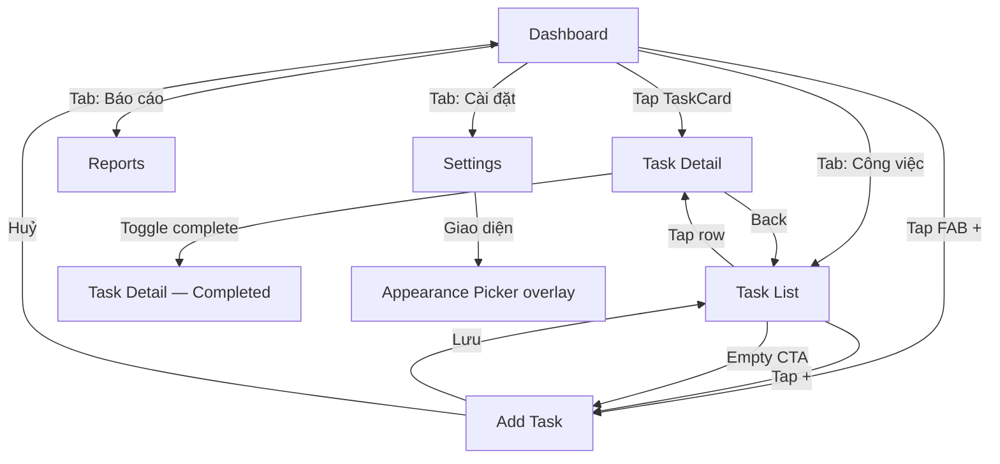

# Jobs Management — Figma Design Specification

> **Document type:** Design specification (Figma substitute)  
> **Platform:** iOS · iPhone 15 Pro  
> **Frame size:** 393 × 852 pt  
> **Language:** Vietnamese (UI)  
> **Style:** Apple HIG · Liquid Glass · Things 3 / Todoist minimalism  
> **Version:** 1.0 · July 2026

---

## Table of Contents

1. [Design Principles](#1-design-principles)
2. [Figma File Structure](#2-figma-file-structure)
3. [Design Tokens](#3-design-tokens)
4. [Component Library](#4-component-library)
5. [Screen Specifications](#5-screen-specifications)
6. [Dark Mode](#6-dark-mode)
7. [Prototype Flows](#7-prototype-flows)
8. [Assets & Icons](#8-assets--icons)
9. [Developer Handoff Notes](#9-developer-handoff-notes)

---

## 1. Design Principles

### 1.1 Visual Direction

| Principle | Application |
|-----------|-------------|
| **Clarity over decoration** | One primary action per screen; generous whitespace; no ornamental gradients on content areas |
| **Liquid Glass** | Navigation bars, tab bars, floating action areas, and modal sheets use frosted glass (`backdrop-blur` equivalent: 20–40px) with 72–88% opacity fills |
| **Depth through layers** | Content scrolls beneath glass chrome; cards sit on `Background/Secondary`; elevated surfaces use subtle shadow + 1px hairline border |
| **Things 3 influence** | Calm typography hierarchy, soft category colors, checklist-centric task detail |
| **Todoist influence** | Quick-add affordance, category chips, progress visualization, reports dashboard |
| **Apple HIG** | 44pt minimum touch targets, SF Pro system font, semantic colors, safe-area respect, standard iOS navigation patterns |

### 1.2 Layout Grid

```
┌─────────────────────────────────────┐  ← Frame: 393 × 852
│  Safe Area Top: 59pt (Dynamic Island)│
│  ┌───────────────────────────────┐  │
│  │  Content margin: 16pt (L/R)   │  │  ← 4pt base grid
│  │  Section gap: 24pt            │  │
│  │  Card internal padding: 16pt  │  │
│  │  List row height: 56pt min    │  │
│  └───────────────────────────────┘  │
│  Tab Bar: 49pt + Safe Area Bottom   │  ← 34pt on iPhone 15 Pro
└─────────────────────────────────────┘
```

- **Base unit:** 4pt  
- **Horizontal margins:** 16pt (content), 20pt (full-bleed cards with inset)  
- **Vertical rhythm:** 8pt (tight), 12pt (default), 16pt (comfortable), 24pt (section), 32pt (major section)

---

## 2. Figma File Structure

### 2.1 Pages

| Page | Contents |
|------|----------|
| **📐 Cover** | Project title, version, device frame legend |
| **🎨 Design Tokens** | Color styles, text styles, effect styles, spacing annotations |
| **🧩 Components** | Component library frame + variants |
| **📱 Screens — Light** | 7 light-mode frames |
| **🌙 Screens — Dark** | Dark Mode showcase frame |
| **🔗 Prototype** | Linked flows (see §7) |

### 2.2 Frames (8 total)

| # | Frame Name | Size | Purpose |
|---|------------|------|---------|
| 1 | `Dashboard` | 393 × 852 | Home overview, stats, today's tasks |
| 2 | `Task List` | 393 × 852 | Filterable task list by status/category |
| 3 | `Task Detail` | 393 × 852 | Single task with steps, metadata, actions |
| 4 | `Add Task` | 393 × 852 | Create new task form (sheet-style) |
| 5 | `Reports` | 393 × 852 | Analytics, completion trends, category breakdown |
| 6 | `Settings` | 393 × 852 | Preferences, appearance, notifications |
| 7 | `Components` | 393 × 852 | Component anatomy reference board |
| 8 | `Dark Mode` | 393 × 852 | Dark theme composite showcase |

Each frame includes:
- iPhone 15 Pro device bezel (optional, for presentation)
- Status bar: 59pt height (time left, Dynamic Island center, icons right)
- Home indicator: 34pt safe area at bottom (5pt pill, centered, 134 × 5pt)

---

## 3. Design Tokens

### 3.1 Typography — SF Pro

| Token | Font | Size | Weight | Line Height | Letter Spacing | Usage |
|-------|------|------|--------|-------------|----------------|-------|
| `Display/Large` | SF Pro Display | 34pt | Bold (700) | 41pt | −0.4pt | Screen titles (rare) |
| `Display/Medium` | SF Pro Display | 28pt | Bold (700) | 34pt | −0.3pt | Dashboard greeting |
| `Title/Large` | SF Pro Text | 22pt | Semibold (600) | 28pt | −0.2pt | Section headers |
| `Title/Medium` | SF Pro Text | 17pt | Semibold (600) | 22pt | −0.2pt | Card titles, nav titles |
| `Body/Large` | SF Pro Text | 17pt | Regular (400) | 22pt | −0.2pt | Primary body, task names |
| `Body/Medium` | SF Pro Text | 15pt | Regular (400) | 20pt | −0.1pt | Secondary descriptions |
| `Body/Small` | SF Pro Text | 13pt | Regular (400) | 18pt | 0pt | Captions, metadata |
| `Label/Large` | SF Pro Text | 15pt | Medium (500) | 20pt | −0.1pt | Buttons, chips |
| `Label/Medium` | SF Pro Text | 13pt | Medium (500) | 18pt | 0pt | Tab labels, badges |
| `Label/Small` | SF Pro Text | 11pt | Medium (500) | 13pt | 0.2pt | Overlines, stat labels |
| `Mono/Stat` | SF Pro Rounded | 32pt | Bold (700) | 38pt | −0.5pt | Large stat numbers |

**Figma text styles:** Create one style per row; name as `Category/Size`.

### 3.2 Color — Semantic Palette

#### Light Mode

| Token | Hex | Usage |
|-------|-----|-------|
| `Background/Primary` | `#F2F2F7` | Screen background (system grouped) |
| `Background/Secondary` | `#FFFFFF` | Cards, sheets, elevated surfaces |
| `Background/Tertiary` | `#E5E5EA` | Input fields, inactive chips |
| `Background/Glass` | `#FFFFFFB8` (72% white) | Frosted nav/tab bars over content |
| `Label/Primary` | `#000000` | Primary text |
| `Label/Secondary` | `#3C3C43` @ 60% → `#3C3C4399` | Subtitles, metadata |
| `Label/Tertiary` | `#3C3C43` @ 30% → `#3C3C434D` | Placeholders, disabled |
| `Separator` | `#3C3C43` @ 12% → `#3C3C431F` | Hairlines, dividers |
| `Accent/Primary` | `#007AFF` | Primary actions, links, active tab |
| `Accent/PrimaryPressed` | `#0056B3` | Button pressed state |
| `Accent/Success` | `#34C759` | Completed tasks, positive trends |
| `Accent/Warning` | `#FF9500` | Due soon, medium priority |
| `Accent/Danger` | `#FF3B30` | Overdue, high priority, delete |
| `Accent/Purple` | `#AF52DE` | Category: Personal |
| `Accent/Teal` | `#5AC8FA` | Category: Work |
| `Accent/Orange` | `#FF9500` | Category: Urgent |
| `Accent/Pink` | `#FF2D55` | Category: Health |
| `Accent/Indigo` | `#5856D6` | Category: Learning |
| `Fill/Quaternary` | `#787880` @ 8% → `#78788014` | Subtle card hover/press |
| `Shadow/Card` | `#000000` @ 8%, blur 16, y-offset 4 | Card elevation |
| `Shadow/Glass` | `#000000` @ 4%, blur 24, y-offset 8 | Sheet/modal elevation |

#### Dark Mode

| Token | Hex | Usage |
|-------|-----|-------|
| `Background/Primary` | `#000000` | Screen background |
| `Background/Secondary` | `#1C1C1E` | Cards, elevated surfaces |
| `Background/Tertiary` | `#2C2C2E` | Input fields, inactive chips |
| `Background/Glass` | `#1C1C1EB8` (72% `#1C1C1E`) | Frosted chrome |
| `Label/Primary` | `#FFFFFF` | Primary text |
| `Label/Secondary` | `#EBEBF5` @ 60% → `#EBEBF599` | Subtitles |
| `Label/Tertiary` | `#EBEBF5` @ 30% → `#EBEBF54D` | Placeholders |
| `Separator` | `#545458` @ 65% → `#545458A6` | Dividers |
| `Accent/Primary` | `#0A84FF` | Primary actions (dark elevated blue) |
| `Accent/Success` | `#30D158` | Completed |
| `Accent/Warning` | `#FF9F0A` | Due soon |
| `Accent/Danger` | `#FF453A` | Overdue, delete |
| *(Category accents unchanged)* | — | Maintain hue; reduce saturation 5% on dark if needed |

### 3.3 Corner Radius

| Token | Value | Usage |
|-------|-------|-------|
| `Radius/XS` | 4pt | Checkboxes, tiny badges |
| `Radius/SM` | 8pt | Chips, small buttons |
| `Radius/MD` | 12pt | Input fields, small cards |
| `Radius/LG` | 16pt | Task cards, stat cards |
| `Radius/XL` | 20pt | Modal sheets (top corners) |
| `Radius/Full` | 9999pt | Pills, circular FAB |

### 3.4 Spacing Scale (4pt Grid)

| Token | Value |
|-------|-------|
| `Space/1` | 4pt |
| `Space/2` | 8pt |
| `Space/3` | 12pt |
| `Space/4` | 16pt |
| `Space/5` | 20pt |
| `Space/6` | 24pt |
| `Space/8` | 32pt |
| `Space/10` | 40pt |
| `Space/12` | 48pt |

### 3.5 Effects — Liquid Glass

| Effect | Properties |
|--------|------------|
| `Glass/Navigation` | Fill: `Background/Glass` · Background blur: 20px · Border: 1px top `Separator` · Shadow: none |
| `Glass/TabBar` | Fill: `Background/Glass` · Background blur: 20px · Border: 1px top `Separator` |
| `Glass/Sheet` | Fill: `Background/Secondary` @ 95% · Background blur: 40px · Radius: `Radius/XL` top · Shadow: `Shadow/Glass` |
| `Glass/FAB` | Fill: `Accent/Primary` · Shadow: `#007AFF40`, blur 12, y 4 · Size: 56 × 56pt · Radius: `Radius/Full` |

### 3.6 Iconography

- **Library:** SF Symbols 5 (iOS 17+)
- **Default size:** 20pt (inline), 24pt (toolbar), 28pt (tab bar)
- **Weight:** Regular (400) default; Semibold for selected states
- **Color:** Inherits `Label/Secondary`; active states use `Accent/Primary`

---

## 4. Component Library

> **Frame:** `Components` (393 × 852) — scrollable anatomy board with light background.

### 4.1 TaskCard

Primary list item for tasks. Used on Dashboard and Task List screens.

```
┌──────────────────────────────────────────────────────┐  ← 361 × auto (min 80pt)
│ ○  Hoàn thành báo cáo tuần              ⋯           │  ← 16pt padding all sides
│    Công việc · Hạn: 15/07                            │
│    ████████░░░░░░░░  45%                              │  ← ProgressBar embedded
└──────────────────────────────────────────────────────┘
```

| Property | Value |
|----------|-------|
| **Width** | Fill container (361pt within 16pt margins) |
| **Min height** | 80pt |
| **Background** | `Background/Secondary` |
| **Border** | 1px `Separator` (optional; omit in grouped list style) |
| **Radius** | `Radius/LG` (16pt) |
| **Shadow** | `Shadow/Card` (standalone cards only) |
| **Padding** | 16pt |
| **Gap (vertical)** | 8pt between title row and metadata row; 12pt to progress |

**Anatomy:**

| # | Element | Spec |
|---|---------|------|
| A | **Checkbox** | 24 × 24pt circle · stroke 2px `Label/Tertiary` · tap toggles complete · filled: `Accent/Success` + white checkmark SF Symbol `checkmark` 14pt |
| B | **Title** | `Body/Large` · `Label/Primary` · max 2 lines · strikethrough + `Label/Tertiary` when complete |
| C | **Overflow** | SF Symbol `ellipsis` 20pt · `Label/Tertiary` · 44 × 44pt hit area |
| D | **Metadata row** | `Body/Small` · `Label/Secondary` · format: `{category} · Hạn: {dd/MM}` |
| E | **ProgressBar** | See §4.5 · width: fill · margin-top: 12pt |
| F | **Priority dot** | 8 × 8pt circle · left of title (optional) · `Accent/Danger` / `Accent/Warning` / none |

**Variants (Figma component properties):**

| Property | Values |
|----------|--------|
| `State` | Default · Pressed · Completed |
| `Priority` | None · Medium · High |
| `ShowProgress` | True · False |
| `Style` | Card (elevated) · Inset (grouped, no shadow) |

**Vietnamese sample content:**
- Title: "Hoàn thành báo cáo tuần"
- Meta: "Công việc · Hạn: 15/07"

---

### 4.2 StepRow

Checklist step within Task Detail.

```
┌──────────────────────────────────────────────────────┐  ← 361 × 48pt
│  ○   Thu thập dữ liệu từ phòng ban                    │
└──────────────────────────────────────────────────────┘
```

| Property | Value |
|----------|-------|
| **Height** | 48pt (touch target compliant) |
| **Padding** | 0pt horizontal (parent provides 16pt) |
| **Gap** | 12pt between checkbox and label |

**Anatomy:**

| # | Element | Spec |
|---|---------|------|
| A | **Checkbox** | 22 × 22pt · radius `Radius/XS` (4pt) square with 4pt corner (iOS style rounded rect) · unchecked: 2px stroke `Label/Tertiary` · checked: fill `Accent/Primary` + white `checkmark` 12pt |
| B | **Label** | `Body/Large` · `Label/Primary` · 1 line default, wrap allowed |
| C | **Reorder handle** | SF Symbol `line.3.horizontal` 16pt · `Label/Tertiary` · trailing, edit mode only |

**Variants:**

| Property | Values |
|----------|--------|
| `State` | Unchecked · Checked · Disabled |
| `EditMode` | True · False |

**Vietnamese sample:** "Thu thập dữ liệu từ phòng ban"

---

### 4.3 StatCard

Compact metric card for Dashboard and Reports.

```
┌─────────────────────┐  ← 109 × 96pt (3-column grid)
│  ĐANG LÀM           │  ← Label/Small, uppercase optional
│  12                 │  ← Mono/Stat
│  ↑ 3 so với tuần    │  ← Body/Small, Accent/Success
└─────────────────────┘
```

| Property | Value |
|----------|-------|
| **Size** | 109 × 96pt (flex: 1 in 3-col grid, 8pt gutters) |
| **Background** | `Background/Secondary` |
| **Radius** | `Radius/LG` (16pt) |
| **Padding** | 12pt |
| **Border** | 1px `Separator` (light mode subtle) |

**Anatomy:**

| # | Element | Spec |
|---|---------|------|
| A | **Label** | `Label/Small` · `Label/Secondary` · uppercase tracking 0.5pt |
| B | **Value** | `Mono/Stat` · `Label/Primary` · margin-top: 4pt |
| C | **Trend** | `Body/Small` · `Accent/Success` (up) or `Accent/Danger` (down) · margin-top: 4pt |
| D | **Icon (optional)** | 16pt SF Symbol top-right · 30% opacity |

**Variants:**

| Property | Values |
|----------|--------|
| `Trend` | Up · Down · Neutral |
| `Accent` | Default · Primary · Success · Warning |

**Vietnamese labels:**
- "ĐANG LÀM" / "HOÀN THÀNH" / "QUÁ HẠN"
- Trend: "↑ 3 so với tuần trước" / "↓ 2 so với tuần trước"

---

### 4.4 CategoryChip

Filter and label chip for categories.

```
┌──────────────────┐  ← auto × 32pt
│  ● Công việc  ✕  │
└──────────────────┘
```

| Property | Value |
|----------|-------|
| **Height** | 32pt |
| **Padding** | 12pt horizontal, 6pt vertical |
| **Radius** | `Radius/Full` |
| **Gap** | 6pt between dot, label, dismiss |

**Anatomy:**

| # | Element | Spec |
|---|---------|------|
| A | **Color dot** | 8 × 8pt circle · category accent color |
| B | **Label** | `Label/Medium` · `Label/Primary` |
| C | **Dismiss (optional)** | SF Symbol `xmark` 12pt · `Label/Tertiary` · 44pt hit area |

**Variants:**

| Property | Values |
|----------|--------|
| `State` | Default · Selected · Disabled |
| `Category` | Work · Personal · Urgent · Health · Learning · All |
| `ShowDismiss` | True · False |

**Selected state:** Background = category color @ 15% opacity; border 1.5px category color; label `Label/Primary`.

**Vietnamese categories:**

| Key | Label | Color |
|-----|-------|-------|
| work | Công việc | `#5AC8FA` |
| personal | Cá nhân | `#AF52DE` |
| urgent | Khẩn cấp | `#FF9500` |
| health | Sức khỏe | `#FF2D55` |
| learning | Học tập | `#5856D6` |
| all | Tất cả | `Label/Secondary` |

---

### 4.5 ProgressBar

Horizontal progress indicator.

```
████████████████░░░░░░░░░░░░░░  45%
```

| Property | Value |
|----------|-------|
| **Track height** | 6pt |
| **Track radius** | `Radius/Full` |
| **Track fill** | `Background/Tertiary` |
| **Progress fill** | `Accent/Primary` (default) or category color |
| **Width** | Fill parent |
| **Label** | `Body/Small` · `Label/Secondary` · trailing or below (+4pt gap) |

**Variants:**

| Property | Values |
|----------|--------|
| `Progress` | 0–100 (show at 10% increments in Figma) |
| `ShowLabel` | True · False |
| `Color` | Primary · Success · Category |

---

### 4.6 EmptyState

Placeholder when no content exists.

```
        ┌────────┐
        │  📋  │   ← 64pt icon area
        └────────┘
     Chưa có công việc
  Thêm công việc đầu tiên để bắt đầu

      [ + Thêm công việc ]
```

| Property | Value |
|----------|-------|
| **Container** | Centered vertically in content area (offset −40pt optical) |
| **Max width** | 280pt |
| **Alignment** | Center |

**Anatomy:**

| # | Element | Spec |
|---|---------|------|
| A | **Illustration** | SF Symbol `tray` or `checklist` · 48pt · `Label/Tertiary` @ 40% · inside 80 × 80pt circle fill `Fill/Quaternary` |
| B | **Title** | `Title/Medium` · `Label/Primary` · center · margin-top: 16pt |
| C | **Description** | `Body/Medium` · `Label/Secondary` · center · margin-top: 8pt · max 2 lines |
| D | **CTA Button** | margin-top: 24pt · see Button spec below |

**Variants:**

| Property | Values |
|----------|--------|
| `Context` | NoTasks · NoResults · NoReports · Error |
| `ShowCTA` | True · False |

**Vietnamese copy:**

| Context | Title | Description | CTA |
|---------|-------|-------------|-----|
| NoTasks | Chưa có công việc | Thêm công việc đầu tiên để bắt đầu | + Thêm công việc |
| NoResults | Không tìm thấy kết quả | Thử thay đổi bộ lọc hoặc từ khóa | Xóa bộ lọc |
| NoReports | Chưa có dữ liệu | Hoàn thành công việc để xem báo cáo | — |

---

### 4.7 Shared Elements

#### Primary Button
- Height: 50pt · Radius: `Radius/MD` (12pt) · Fill: `Accent/Primary` · Label: `Label/Large` white · Full width or hug

#### Secondary Button
- Height: 50pt · Radius: `Radius/MD` · Fill: `Fill/Quaternary` · Label: `Label/Large` `Accent/Primary`

#### Tab Bar Item
- Size: 78 × 49pt hit area · Icon 24pt · Label `Label/Small` · Active: `Accent/Primary` · Inactive: `Label/Tertiary`

#### Search Field
- Height: 36pt · Radius: `Radius/MD` · Fill: `Background/Tertiary` · Padding: 8pt 12pt · Icon `magnifyingglass` 16pt · Placeholder: `Body/Medium` `Label/Tertiary`

---

## 5. Screen Specifications

### 5.1 Dashboard

**Frame:** `Dashboard` · 393 × 852 · Light mode

#### Layout Structure

```
Y=0    ┌─ Status Bar ─────────────────────────────┐  59pt
Y=59   ├─ Navigation Bar (glass) ─────────────────┤  44pt
       │  Xin chào, Minh            [avatar 32pt] │
Y=103  ├─ Scroll Content ───────────────────────────┤
       │  Hôm nay                    ← Display/Medium
       │  T7, 4 tháng 7 2026         ← Body/Small, secondary
       │                              8pt gap
       │  ┌─────┐ ┌─────┐ ┌─────┐    ← StatCard row, 24pt below
       │  │Stat │ │Stat │ │Stat │    Y=175, height 96pt
       │  └─────┘ └─────┘ └─────┘
       │                              24pt gap
       │  Việc cần làm      Xem tất cả ← Title/Large + link Body/Small
       │                              12pt gap
       │  [TaskCard]                    × 3 items, 12pt gap
       │  [TaskCard]
       │  [TaskCard]
       │                              24pt gap
       │  Danh mục                      ← Title/Large
       │  [Chip] [Chip] [Chip] →       ← horizontal scroll, 12pt gap, 40pt below title
Y=759  ├─ Tab Bar (glass) ────────────────────────┤  49pt
Y=808  └─ Home Indicator Safe Area ────────────────┘  34pt
```

#### Measurements

| Region | Position (Y) | Size | Notes |
|--------|------------|------|-------|
| Status bar | 0 | 393 × 59 | System |
| Nav bar | 59 | 393 × 44 | Glass effect; transparent over scroll |
| Greeting block | 103 | 361 × 52 | 16pt side margins |
| Stat cards row | 175 | 361 × 96 | 3 × StatCard, 8pt gutters |
| Section: Việc cần làm | 295 | 361 × auto | Header 28pt tall |
| Task list | 335 | 361 × auto | 3 TaskCards, 12pt spacing |
| Section: Danh mục | — | 361 × auto | Chips horizontal scroll, height 32pt |
| Tab bar | 759 | 393 × 49 | 4 tabs |
| FAB (Add) | x=313, y=687 | 56 × 56 | Above tab bar, 16pt from right edge |

#### Content Copy (Vietnamese)

| Element | Text |
|---------|------|
| Greeting | Xin chào, Minh |
| Date | T7, 4 tháng 7 2026 |
| Section 1 title | Việc cần làm |
| Section 1 link | Xem tất cả |
| Section 2 title | Danh mục |
| Stat 1 | ĐANG LÀM / 12 / ↑ 3 so với tuần trước |
| Stat 2 | HOÀN THÀNH / 28 / ↑ 5 so với tuần trước |
| Stat 3 | QUÁ HẠN / 2 / ↓ 1 so với tuần trước |
| Tab labels | Trang chủ · Công việc · Báo cáo · Cài đặt |

#### Tab Bar Icons (SF Symbols)
- Trang chủ: `house.fill` (active)
- Công việc: `checklist`
- Báo cáo: `chart.bar.fill`
- Cài đặt: `gearshape`

---

### 5.2 Task List

**Frame:** `Task List` · 393 × 852

#### Layout Structure

```
Y=59   ├─ Nav Bar ──────────────────────────────────┤
       │  Công việc                    [+ icon]    │
Y=103  │  [🔍 Tìm kiếm công việc...]                │  36pt search, 16pt margins
Y=147  │  [Tất cả] [Công việc] [Cá nhân] [Khẩn] →  │  chips, 32pt, 12pt gap
Y=191  │  Đang làm (5)                               │  Title/Large section header
       │  [TaskCard — inset style]                   │
       │  [TaskCard]                                 │  8pt gap (grouped)
       │  [TaskCard]                                 │
Y=—    │  Hoàn thành (3)                             │  24pt section gap
       │  [TaskCard — completed]                     │
       │  [TaskCard — completed]                     │
Y=759  ├─ Tab Bar ───────────────────────────────────┤
```

#### Measurements

| Element | Spec |
|---------|------|
| Nav title | `Title/Medium` centered · trailing `plus` 22pt in 44pt tap area |
| Search field | 361 × 36 · 12pt below nav · `Background/Tertiary` |
| Filter chips | 12pt below search · horizontal scroll · 16pt left padding, 8pt between chips |
| Section header | `Title/Large` · 20pt top padding · trailing count `Body/Small` `Label/Secondary` |
| Grouped cards | Shared `Background/Secondary` container · radius `Radius/LG` · internal dividers 1px `Separator` · inset 16pt margins |
| Row gap (grouped) | 0 (dividers) |
| Section gap | 24pt |

#### Segmented Sections

| Section | Header | Count |
|---------|--------|-------|
| Active | Đang làm | (5) |
| Done | Hoàn thành | (3) |

---

### 5.3 Task Detail

**Frame:** `Task Detail` · 393 × 852

#### Layout Structure

```
Y=59   ├─ Nav Bar ──────────────────────────────────┤
       │  ← Back    Chi tiết công việc    [⋯]      │
Y=103  │  ┌─────────────────────────────────────┐  │
       │  │ ● Công việc          [CategoryChip]  │  │  hero card
       │  │                                      │  │
       │  │ Hoàn thành báo cáo tuần              │  │  Title/Large
       │  │                                      │  │
       │  │ 📅 Hạn: 15/07/2026   ⚑ Cao          │  │  metadata row
       │  │ ████████░░░░░░░░  45%               │  │
       │  └─────────────────────────────────────┘  │  361×auto, ~160pt
Y=—    │  Các bước thực hiện            2/5        │  section header
       │  [StepRow]                                     │
       │  [StepRow]                                     │  0pt gap (dividers)
       │  [StepRow]                                     │
       │  [StepRow]                                     │
       │  [StepRow]                                     │
Y=—    │  Ghi chú                                      │  24pt gap
       │  ┌─────────────────────────────────────┐  │
       │  │ Tổng hợp số liệu Q2 và gửi...        │  │  Body/Medium
       │  └─────────────────────────────────────┘  │
Y=—    │  [ Đánh dấu hoàn thành ]                      │  fixed bottom CTA, 16pt margin
Y=759  ├─ Tab Bar (hidden or dimmed) ─────────────────┤
```

#### Hero Card Measurements

| Property | Value |
|----------|-------|
| Size | 361 × 160pt (min) |
| Padding | 20pt |
| Radius | `Radius/LG` |
| Background | `Background/Secondary` |
| Title margin-top | 12pt below chip row |
| Metadata margin-top | 16pt |
| Progress margin-top | 16pt |

#### Metadata Icons

| Field | Icon | Label |
|-------|------|-------|
| Due date | `calendar` | Hạn: 15/07/2026 |
| Priority | `flag.fill` | Cao / Trung bình / Thấp |

#### Bottom CTA
- Position: 16pt above tab bar (or safe area if tab hidden)
- Button: Primary · full width 361pt · "Đánh dấu hoàn thành"
- Completed state: Secondary · "Đã hoàn thành ✓"

---

### 5.4 Add Task

**Frame:** `Add Task` · 393 × 852 · Presented as sheet (glass backdrop)

#### Layout Structure

```
       │ ░░░░░░░░░░ dimmed backdrop ░░░░░░░░░░░░░░ │  #00000066
Y=120  ┌─ Sheet (glass, top radius 20pt) ─────────┐
       │  ───  drag indicator 36×5 ───              │  centered, 8pt from top
       │  Thêm công việc              [Huỷ]        │  Title/Medium · 44pt header
       │                                              │
       │  Tên công việc *                             │  Label/Medium, secondary
       │  ┌──────────────────────────────────────┐   │
       │  │ Nhập tên công việc...                 │   │  48pt input
       │  └──────────────────────────────────────┘   │
       │  12pt gap                                      │
       │  Danh mục                                      │
       │  [Công việc ▾]                                 │  picker row 48pt
       │  12pt gap                                      │
       │  Hạn hoàn thành                                │
       │  [15/07/2026 ▾]                                │  date picker row
       │  12pt gap                                      │
       │  Độ ưu tiên                                    │
       │  ( ) Thấp  (•) Trung bình  ( ) Cao            │  segmented, 36pt
       │  12pt gap                                      │
       │  Các bước                                      │
       │  ┌──────────────────────────────────────┐   │
       │  │ + Thêm bước                           │   │
       │  └──────────────────────────────────────┘   │
       │  12pt gap                                      │
       │  Ghi chú                                       │
       │  ┌──────────────────────────────────────┐   │
       │  │                                       │   │  96pt textarea
       │  │                                       │   │
       │  └──────────────────────────────────────┘   │
       │                                              │
       │  [      Lưu công việc      ]                 │  primary button, 16pt margin
       └──────────────────────────────────────────────┘
```

#### Sheet Measurements

| Property | Value |
|----------|-------|
| Sheet top offset | 120pt from frame top |
| Sheet width | 393pt full bleed |
| Top corner radius | 20pt |
| Drag indicator | 36 × 5pt · `Label/Tertiary` · radius full |
| Content padding | 16pt horizontal |
| Field label | `Label/Medium` · `Label/Secondary` · 8pt above field |
| Input height | 48pt · radius `Radius/MD` · fill `Background/Tertiary` · padding 12pt |
| Field vertical gap | 20pt (between field groups) |
| Segmented control | 361 × 36pt · radius 8pt |
| Save button | 361 × 50pt · 24pt below last field · sticky at bottom with 16pt padding |

#### Form Labels (Vietnamese)

| Field | Label | Placeholder |
|-------|-------|-------------|
| Name | Tên công việc * | Nhập tên công việc... |
| Category | Danh mục | Công việc |
| Due date | Hạn hoàn thành | Chọn ngày |
| Priority | Độ ưu tiên | Thấp / Trung bình / Cao |
| Steps | Các bước | + Thêm bước |
| Notes | Ghi chú | Thêm ghi chú (tuỳ chọn) |
| Cancel | Huỷ | — |
| Submit | Lưu công việc | — |

---

### 5.5 Reports

**Frame:** `Reports` · 393 × 852

#### Layout Structure

```
Y=59   ├─ Nav Bar: Báo cáo ─────────────────────────┤
Y=103  │  [Tuần này ▾]                                │  period picker, 36pt
       │  24pt gap                                      │
       │  ┌─────────────────────────────────────────┐  │
       │  │  Tỷ lệ hoàn thành                        │  │  hero stat card 120pt
       │  │  78%                                     │  │  Mono/Stat 48pt
       │  │  ████████████████████░░░░░               │  │
       │  │  28/36 công việc                         │  │
       │  └─────────────────────────────────────────┘  │
       │  24pt gap                                      │
       │  ┌─────┐ ┌─────┐ ┌─────┐                       │  StatCard row
       │  └─────┘ └─────┘ └─────┘                       │
       │  24pt gap                                      │
       │  Theo danh mục                                 │  Title/Large
       │  ┌─────────────────────────────────────────┐  │
       │  │ Công việc    ████████████░░  75%    9   │  │  bar row 44pt
       │  │ Cá nhân      ██████░░░░░░░░  50%    4   │  │
       │  │ Học tập      ██████████████  100%  3  │  │
       │  └─────────────────────────────────────────┘  │
       │  24pt gap                                      │
       │  Xu hướng 7 ngày                               │
       │  ┌─────────────────────────────────────────┐  │
       │  │     [simple bar chart area]              │  │  160pt chart
       │  │  T2  T3  T4  T5  T6  T7  CN              │  │
       │  └─────────────────────────────────────────┘  │
Y=759  ├─ Tab Bar ─────────────────────────────────────┤
```

#### Chart Specs (Figma vector / placeholder)

| Element | Spec |
|---------|------|
| Hero card | 361 × 120pt · padding 20pt · `Background/Secondary` · radius 16pt |
| Completion % | `Mono/Stat` 48pt · `Accent/Primary` |
| Bar chart area | 361 × 160pt · bars: 24pt wide, 8pt gap, `Accent/Primary` @ 80% height max |
| Category row | 44pt height · label 100pt wide · bar flex · count 32pt trailing |
| Day labels | `Label/Small` · `Label/Tertiary` · T2–CN (Mon–Sun Vietnamese abbreviations) |

#### Vietnamese Labels

| Element | Text |
|---------|------|
| Period picker | Tuần này / Tháng này / Năm nay |
| Hero label | Tỷ lệ hoàn thành |
| Subtext | 28/36 công việc |
| Section | Theo danh mục / Xu hướng 7 ngày |

---

### 5.6 Settings

**Frame:** `Settings` · 393 × 852

#### Layout Structure

```
Y=59   ├─ Nav Bar: Cài đặt ─────────────────────────┤
Y=103  │  ┌─ Group: Tài khoản ─────────────────────┐  │
       │  │ [Avatar]  Minh Nguyễn                  │  │  64pt row
       │  │           minh@email.com            >  │  │
       │  └────────────────────────────────────────┘  │
       │  24pt gap                                      │
       │  ┌─ Group: Giao diện ─────────────────────┐  │
       │  │ Giao diện          Hệ thống        >  │  │  48pt rows
       │  │ ─────────────────────────────────────  │  │
       │  │ Ngôn ngữ           Tiếng Việt      >  │  │
       │  └────────────────────────────────────────┘  │
       │  24pt gap                                      │
       │  ┌─ Group: Thông báo ────────────────────┐  │
       │  │ Nhắc nhở hạn       [toggle on]          │  │
       │  │ ─────────────────────────────────────    │  │
       │  │ Nhắc buổi sáng     [toggle on]          │  │
       │  │ ─────────────────────────────────────    │  │
       │  │ Âm thanh           [toggle off]         │  │
       │  └────────────────────────────────────────┘  │
       │  24pt gap                                      │
       │  ┌─ Group: Dữ liệu ──────────────────────┐  │
       │  │ Xuất dữ liệu                       >  │  │
       │  │ ─────────────────────────────────────    │  │
       │  │ Xóa tất cả dữ liệu            (đỏ)    │  │  Accent/Danger
       │  └────────────────────────────────────────┘  │
       │  24pt gap                                      │
       │  Phiên bản 1.0.0                               │  Body/Small, centered, tertiary
Y=759  ├─ Tab Bar ─────────────────────────────────────┤
```

#### Settings Group Specs

| Property | Value |
|----------|-------|
| Group container | 361pt wide · `Background/Secondary` · radius `Radius/LG` |
| Row height | 48pt (standard) · 64pt (profile row) |
| Row padding | 16pt horizontal |
| Divider | 1px `Separator` · inset 16pt left (aligned past icon if present) |
| Toggle | iOS standard 51 × 31pt · on: `Accent/Success` |
| Chevron | SF Symbol `chevron.right` 14pt · `Label/Tertiary` |
| Destructive label | `Body/Large` · `Accent/Danger` |

#### Vietnamese Labels

| Group | Rows |
|-------|------|
| Tài khoản | Profile: Minh Nguyễn / minh@email.com |
| Giao diện | Giao diện · Ngôn ngữ |
| Thông báo | Nhắc nhở hạn · Nhắc buổi sáng · Âm thanh |
| Dữ liệu | Xuất dữ liệu · Xóa tất cả dữ liệu |
| Footer | Phiên bản 1.0.0 |

---

### 5.7 Components (Reference Board)

**Frame:** `Components` · 393 × 852 · Scrollable

Vertical stack of labeled component specimens with annotation callouts (red 1px lines, 11pt annotation labels per Figma Dev Mode convention).

| Y-offset | Block | Contents |
|----------|-------|----------|
| 16 | Header | "Thư viện thành phần" — `Display/Medium` |
| 60 | § TaskCard | All variants in 8pt vertical stack with 24pt label |
| 280 | § StepRow | Unchecked / Checked / Edit mode |
| 380 | § StatCard | 3-column row |
| 500 | § CategoryChip | All categories + selected state |
| 580 | § ProgressBar | 0%, 45%, 100% |
| 660 | § EmptyState | NoTasks context |
| 780 | § Buttons | Primary / Secondary |

**Annotation style:** Dashed `#FF375F` lines · 11pt SF Pro · `#FF375F` text · distance labels in 4pt increments.

---

### 5.8 Dark Mode Showcase

**Frame:** `Dark Mode` · 393 × 852

Composite frame showing miniaturized previews of all primary screens in dark theme, arranged in a 2×2 grid with 12pt gaps.

```
┌────────────────┬────────────────┐
│  Dashboard     │  Task List     │  180 × 390 each (scaled 0.46×)
│  (preview)     │  (preview)     │
├────────────────┼────────────────┤
│  Task Detail   │  Reports       │
│  (preview)     │  (preview)     │
└────────────────┴────────────────┘
     Giao diện tối — Jobs Management
```

| Property | Value |
|----------|-------|
| Background | `Background/Primary` `#000000` |
| Preview scale | 46% of original frame |
| Preview radius | 12pt · border 1px `#Separator` |
| Title below grid | `Title/Large` · "Giao diện tối" · centered · 24pt below grid |
| Subtitle | `Body/Medium` · `Label/Secondary` · "Tự động theo cài đặt hệ thống" |

Full dark-mode specs: see [§6 Dark Mode](#6-dark-mode).

---

## 6. Dark Mode

### 6.1 Implementation Rules

1. **Do not invert images** — reduce luminance 10%; add 1px `Separator` border.
2. **Glass materials** — use `Background/Glass` dark token; blur unchanged (20px).
3. **Elevation** — prefer lighter fills (`#2C2C2E`, `#3A3A3C`) over shadows for depth.
4. **Accent colors** — use dark-mode elevated variants (`#0A84FF`, `#30D158`, `#FF453A`).
5. **Category chips** — background opacity 20% on dark (vs 15% light).

### 6.2 Per-Screen Dark Adjustments

| Screen | Key Changes |
|--------|-------------|
| Dashboard | Stat cards: `#1C1C1E` fill; FAB glow `#0A84FF50` |
| Task List | Grouped list container: `#1C1C1E`; search field: `#2C2C2E` |
| Task Detail | Hero card: `#1C1C1E`; step dividers: `Separator` dark |
| Add Task | Sheet: `#1C1C1E` @ 95%; backdrop `#00000080` |
| Reports | Chart bars: `#0A84FF`; grid lines: `#54545840` |
| Settings | Toggle on: `#30D158`; group cards: `#1C1C1E` |

### 6.3 Side-by-Side Token Mapping

| Element | Light | Dark |
|---------|-------|------|
| Screen BG | `#F2F2F7` | `#000000` |
| Card BG | `#FFFFFF` | `#1C1C1E` |
| Primary text | `#000000` | `#FFFFFF` |
| Secondary text | `#3C3C4399` | `#EBEBF599` |
| Primary button | `#007AFF` | `#0A84FF` |
| Glass nav | `#FFFFFFB8` | `#1C1C1EB8` |

---

## 7. Prototype Flows

Configure in Figma Prototype tab with **iOS Dissolve** or **Move In** transitions (300ms, ease-out).

### 7.1 Flow Map



### 7.2 Interaction Table

| # | Hotspot | Source Frame | Trigger | Action | Destination | Animation |
|---|---------|--------------|---------|--------|-------------|-----------|
| 1 | TaskCard (any) | Dashboard | Tap | Navigate | Task Detail | Push left |
| 2 | FAB `+` | Dashboard | Tap | Open overlay | Add Task | Move In bottom |
| 3 | "Xem tất cả" | Dashboard | Tap | Navigate | Task List | Push left |
| 4 | Tab "Công việc" | Dashboard | Tap | Navigate | Task List | Instant |
| 5 | Tab "Báo cáo" | Dashboard | Tap | Navigate | Reports | Instant |
| 6 | Tab "Cài đặt" | Dashboard | Tap | Navigate | Settings | Instant |
| 7 | Tab "Trang chủ" | Task List | Tap | Navigate | Dashboard | Instant |
| 8 | TaskCard row | Task List | Tap | Navigate | Task Detail | Push left |
| 9 | Nav `+` | Task List | Tap | Open overlay | Add Task | Move In bottom |
| 10 | CategoryChip | Task List | Tap | Filter (state) | Task List (filtered) | Dissolve 200ms |
| 11 | Back `←` | Task Detail | Tap | Back | Task List | Push right |
| 12 | "Đánh dấu hoàn thành" | Task Detail | Tap | State change | Task Detail (completed) | Dissolve 200ms |
| 13 | StepRow checkbox | Task Detail | Tap | Toggle step | Task Detail (progress update) | None |
| 14 | "Lưu công việc" | Add Task | Tap | Submit + close | Task List (new item) | Move Out bottom |
| 15 | "Huỷ" | Add Task | Tap | Dismiss | Previous screen | Move Out bottom |
| 16 | Sheet backdrop | Add Task | Tap | Dismiss | Previous screen | Move Out bottom |
| 17 | Period picker | Reports | Tap | Overlay | Reports (picker open) | Dissolve |
| 18 | Toggle rows | Settings | Tap | Toggle state | Settings (updated) | None |
| 19 | "Xóa tất cả dữ liệu" | Settings | Tap | Alert confirm | System alert overlay | — |
| 20 | Search field | Task List | Tap | Focus keyboard | Task List (keyboard open) | — |

### 7.3 Gesture Specs

| Gesture | Context | Behavior |
|---------|---------|----------|
| Pull to refresh | Task List, Dashboard | Standard iOS spinner · reload data |
| Swipe left on TaskCard | Task List | Reveal: Xóa (red) · Hoàn thành (green) |
| Long press TaskCard | Task List | Haptic · enter reorder mode |
| Drag sheet down | Add Task | Dismiss if >50% or velocity threshold |
| Pinch | — | Not supported |

### 7.4 Alert Dialog (Delete Confirmation)

| Element | Spec |
|---------|------|
| Title | Xóa tất cả dữ liệu? |
| Message | Hành động này không thể hoàn tác. Tất cả công việc sẽ bị xóa vĩnh viễn. |
| Actions | Huỷ (default) · Xóa (destructive) |

---

## 8. Assets & Icons

### 8.1 SF Symbols Reference

| Context | Symbol | Size |
|---------|--------|------|
| Home tab | `house` / `house.fill` | 24pt |
| Tasks tab | `checklist` | 24pt |
| Reports tab | `chart.bar` / `chart.bar.fill` | 24pt |
| Settings tab | `gearshape` / `gearshape.fill` | 24pt |
| Add | `plus` | 22pt (nav) / 24pt (FAB) |
| Back | `chevron.left` | 17pt |
| Search | `magnifyingglass` | 16pt |
| Calendar | `calendar` | 16pt |
| Priority | `flag.fill` | 16pt |
| More | `ellipsis` | 20pt |
| Check | `checkmark` | 14pt |
| Delete | `trash` | 20pt |

### 8.2 App Icon (Reference)

| Property | Value |
|----------|-------|
| Size | 1024 × 1024px |
| Background | Gradient `#007AFF` → `#5856D6` (135°) |
| Foreground | White SF Symbol `checkmark.circle.fill` @ 60% scale |
| Style | Rounded square (iOS mask applied at export) |

### 8.3 Export Presets

| Asset | Format | Scales |
|-------|--------|--------|
| Icons | PDF (vector) | 1x |
| Illustrations | SVG | 1x |
| App icon | PNG | 1x, 2x, 3x |
| Screenshots | PNG | 3x (1179 × 2556) |

---

## 9. Developer Handoff Notes

### 9.1 SwiftUI Mapping

| Figma Token | SwiftUI Equivalent |
|-------------|-------------------|
| `Background/Primary` | `Color(.systemGroupedBackground)` |
| `Background/Secondary` | `Color(.secondarySystemGroupedBackground)` |
| `Label/Primary` | `Color(.label)` |
| `Accent/Primary` | `Color.accentColor` / `Color(.systemBlue)` |
| Glass nav | `.toolbarBackground(.ultraThinMaterial)` |
| Corner 16 | `RoundedRectangle(cornerRadius: 16)` |
| SF Pro | `.font(.body)` etc. (system default) |

### 9.2 Accessibility

| Requirement | Spec |
|-------------|------|
| Dynamic Type | Support XS–XXL; layout reflows at XXL (cards grow vertically) |
| VoiceOver | TaskCard: "{title}, {category}, hạn {date}, {progress}% hoàn thành" |
| Contrast | Minimum 4.5:1 body text; 3:1 large text (WCAG AA) |
| Reduce Motion | Disable parallax on glass; crossfade instead of push |
| Reduce Transparency | Replace glass with solid `Background/Secondary` |

### 9.3 Figma Setup Checklist

- [ ] Create color styles for all tokens in §3.2
- [ ] Create text styles for all tokens in §3.1
- [ ] Create effect styles for glass and shadows in §3.5
- [ ] Build components with variants in §4
- [ ] Place 8 frames per §2.2 and §5
- [ ] Link prototype per §7
- [ ] Enable Dev Mode for inspection
- [ ] Name layers: `Screen/Region/Element/State` (e.g., `Dashboard/Header/Greeting/Text`)

---

## Appendix A — Vietnamese String Catalog

| Key | Vietnamese |
|-----|------------|
| `app.name` | Jobs Management |
| `tab.home` | Trang chủ |
| `tab.tasks` | Công việc |
| `tab.reports` | Báo cáo |
| `tab.settings` | Cài đặt |
| `dashboard.greeting` | Xin chào, {name} |
| `dashboard.today` | Hôm nay |
| `dashboard.tasks_section` | Việc cần làm |
| `dashboard.see_all` | Xem tất cả |
| `dashboard.categories` | Danh mục |
| `tasks.title` | Công việc |
| `tasks.search_placeholder` | Tìm kiếm công việc... |
| `tasks.section.active` | Đang làm |
| `tasks.section.done` | Hoàn thành |
| `task.detail_title` | Chi tiết công việc |
| `task.steps` | Các bước thực hiện |
| `task.notes` | Ghi chú |
| `task.complete` | Đánh dấu hoàn thành |
| `task.completed` | Đã hoàn thành |
| `task.due` | Hạn: {date} |
| `task.priority.high` | Cao |
| `task.priority.medium` | Trung bình |
| `task.priority.low` | Thấp |
| `add.title` | Thêm công việc |
| `add.cancel` | Huỷ |
| `add.save` | Lưu công việc |
| `add.name` | Tên công việc |
| `add.category` | Danh mục |
| `add.due` | Hạn hoàn thành |
| `add.priority` | Độ ưu tiên |
| `add.steps` | Các bước |
| `add.add_step` | + Thêm bước |
| `add.notes` | Ghi chú |
| `reports.title` | Báo cáo |
| `reports.completion_rate` | Tỷ lệ hoàn thành |
| `reports.by_category` | Theo danh mục |
| `reports.trend` | Xu hướng 7 ngày |
| `reports.period.week` | Tuần này |
| `reports.period.month` | Tháng này |
| `reports.period.year` | Năm nay |
| `settings.title` | Cài đặt |
| `settings.account` | Tài khoản |
| `settings.appearance` | Giao diện |
| `settings.language` | Ngôn ngữ |
| `settings.notifications` | Thông báo |
| `settings.data` | Dữ liệu |
| `settings.export` | Xuất dữ liệu |
| `settings.delete_all` | Xóa tất cả dữ liệu |
| `settings.version` | Phiên bản {version} |
| `stat.in_progress` | ĐANG LÀM |
| `stat.completed` | HOÀN THÀNH |
| `stat.overdue` | QUÁ HẠN |
| `category.work` | Công việc |
| `category.personal` | Cá nhân |
| `category.urgent` | Khẩn cấp |
| `category.health` | Sức khỏe |
| `category.learning` | Học tập |
| `category.all` | Tất cả |
| `empty.no_tasks.title` | Chưa có công việc |
| `empty.no_tasks.desc` | Thêm công việc đầu tiên để bắt đầu |
| `empty.no_tasks.cta` | + Thêm công việc |

---

## Appendix B — Frame Layer Tree (Dashboard Example)

```
Dashboard
├── Status Bar (system)
├── NavBar
│   ├── Blur/Glass
│   ├── Greeting/Text ("Xin chào, Minh")
│   └── Avatar/Image (32×32)
├── ScrollView
│   ├── Header/Date
│   ├── Stats/Row
│   │   ├── StatCard/InProgress
│   │   ├── StatCard/Completed
│   │   └── StatCard/Overdue
│   ├── Section/Tasks
│   │   ├── Header
│   │   └── List
│   │       ├── TaskCard/1
│   │       ├── TaskCard/2
│   │       └── TaskCard/3
│   └── Section/Categories
│       └── ChipScroll
├── FAB/Add
├── TabBar
│   ├── Tab/Home [active]
│   ├── Tab/Tasks
│   ├── Tab/Reports
│   └── Tab/Settings
└── Home Indicator (system)
```

---

*End of specification. This document is the single source of truth for visual design until a Figma file is produced.*
