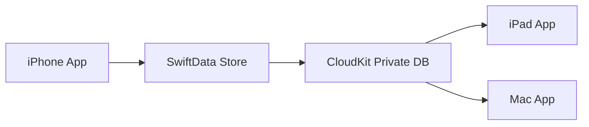

# iCloud Sync Setup

Hướng dẫn cấu hình đồng bộ iCloud cho Jobs Management.

## Kiến trúc

- **Container**: `iCloud.com.jobsmanagement.app`
- **Database**: Private CloudKit (chỉ user đăng nhập iCloud mới thấy dữ liệu của mình)
- **Models sync**: Category, JobTask, TaskStep, TaskReport, Reminder

## Cấu hình Apple Developer

1. Đăng nhập [Apple Developer](https://developer.apple.com)
2. **Certificates, Identifiers & Profiles** → **Identifiers** → chọn App ID `com.jobsmanagement.app`
3. Bật **iCloud** → chọn **CloudKit**
4. Tạo CloudKit container `iCloud.com.jobsmanagement.app` nếu chưa có

## Cấu hình Xcode

1. Mở `JobsManagement.xcodeproj`
2. Target **JobsManagement** → **Signing & Capabilities**
3. **+ Capability** → **iCloud**
4. Tick **CloudKit**, chọn container `iCloud.com.jobsmanagement.app`
5. Kiểm tra `JobsManagement.entitlements` đã được gán trong Build Settings

## Kiểm tra đồng bộ

1. Build và chạy trên 2 thiết bị cùng Apple ID
2. Tạo công việc trên thiết bị A
3. Mở app trên thiết bị B — dữ liệu xuất hiện sau vài giây (cần mạng)
4. Tab **Cài đặt** → **iCloud** hiển thị trạng thái đồng bộ

## Lưu ý

- **Simulator**: cần đăng nhập iCloud trong Settings simulator
- **Thông báo**: nhắc hẹn không sync — mỗi thiết bị tự đăng ký `UserNotifications`
- **Migration**: nếu đã có dữ liệu local trước khi bật iCloud, SwiftData tự migrate lên CloudKit store
- **Conflict**: CloudKit last-write-wins cho hầu hết trường hợp

## Files liên quan

| File | Vai trò |
|---|---|
| `JobsManagementApp.swift` | `ModelConfiguration(cloudKitDatabase:)` |
| `JobsManagement.entitlements` | iCloud + CloudKit capability |
| `CloudSyncConstants.swift` | Container identifier |
| `CloudSyncService.swift` | Trạng thái tài khoản + sự kiện sync |
| `CategorySeeder.swift` | UUID cố định tránh trùng danh mục |
